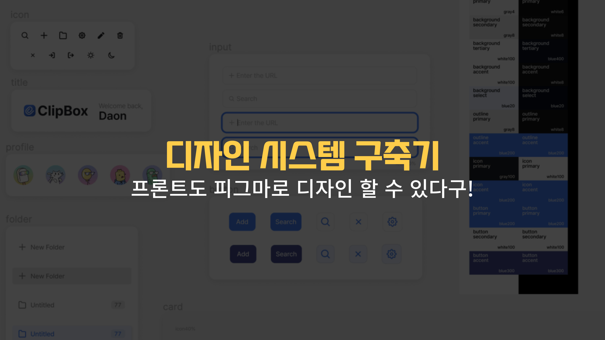

## 들어가며

이전부터 개인 프로젝트를 한다면 기획, 디자인, 서버까지 다 해보고 싶었다. 특히 서버 쪽을 직접 경험해 봐야 어떻게 돌아가는지를 이해하고 확실한 소통이 될 거라는 생각이 들었다. 부트캠프 과정이 끝나고 마침 개인 프로젝트를 할 시간이 나서 이번에 그간의 소망들을 실현해 보고자 해당 프로젝트를 기획했다.

피그마를 손대기 전은 `박스 몇 개 만들어서 색 입히면 되겠지~ 뭐가 어려워?` 하고 간단히 생각했었는데 현실은 네모 박스 만들어서 정렬하는 것조차 10분이 걸렸다.. 주변에서도 피그마로 디자인을 하고싶지만 처음에 다루는 법이 너무 어려워 시도를 안 하는 것을 보고 이번에 삽질을 하면서 깨달았던 내용들을 공유하려고 한다.

처음엔 피그마 사용법에 대해서도 적을까 하다가 피그마 사용법에 대한 내용은 다른 블로그에서도 많이 다루고 설명도 잘되어 있어서 내가 참고한 블로그 링크만 첨부하고 이 글에서는 프로젝트 기획, 디자인 과정과 디자인 시스템을 어떤 식으로 구축했는지에 대해서 이야기 할 예정이다.

---

# 프로젝트 기획과 스케치

## 프로젝트 기획 : 목적과 기능 정의

프로젝트를 하면서 가장 먼저 생각해야 할 것은 프로젝트의 목적이라고 생각한다. 왜 이 프로젝트를 만들게 되었고 어떠한 서비스를 보여주고 싶은 건지를 제대로 정의해두어야만 내가 생각한 방향대로 개발이 이루어질 것이다. 그래서 나는 먼저 프로젝트의 목적과 기능들을 노션에 정리했다.

테스트 케이스를 작성하는 것처럼 사용자가 사이트에 접속했을 때 어떤 상호작용을 할 수 있는지 생각하면서 적어주었다.

> 사용자가 사이트에 들어오면 어떤 행동을 먼저 할까? url을 입력하겠지?
>
> 그럼 url 저장은 버튼을 누를 텐데 버튼만 누르는 것보다 엔터로도 저장이 되면 더 편하지 않을까?

위처럼 기능단위만 적는 것이 아니라 먼저 사용자가 어떤 동작을 할 수 있을지를 판단하면서 기능들을 구체화시켜나갔다.


## 스케치

정의한 기능들을 고려하여 아이패드로 디자인을 그렸다. 처음부터 완벽하게 기획서를 작성하고 바로 디자인 작업을 끝내기란 어려워 나는 기획은 핵심 기능들만 정의한 채로 스케치를 했고 스케치를 보면서 아까 말했던 방식대로 상호작용도 고려해 보고 다시 기획과 스케치를 수정해나가는 방식으로 작업했다. 처음부터 완벽하게 하기란 어렵고 계속해서 수정하면서 디벨롭 하는 게 정답인 것 같다.


## 디자인 참고

이제 스케치한 디자인을 피그마로 구현할 시간이다.

우린 디자이너가 아니기 때문에 디자인적인 센스가 부족하다.
그럼 어떻게 해야 할까? 바로 많은 소스들을 찾아봐야 한다.
나는 dribble과 피그마 커뮤니티에 여러 디자인들을 검색해서 찾아봤다.

특히 피그마 커뮤니티 자료들을 추천하는데 피그마로 구현된 디자인 작업물들을 볼 수 있어 실제 디자이너들을 어떤 식으로 컴포넌트를 그룹화하고 사이즈는 어떻게 하는지 볼 수 있어서 좋다.

[dribble](https://dribbble.com/shots)
[피그마 커뮤니티](https://www.figma.com/community)

---

# 디자인 시스템

나는 이번 프로젝트에 디자인 시스템을 적용해서 만들고 싶었기 때문에 먼저 디자인 시스템을 구축하는 과정을 진행했다.

### 디자인 시스템은 뭘까?

디자인 시스템이란 서비스의 목적에 맞도록 일관되게 구성된 일련의 패턴과 공유된 규칙 언어.
즉, 디자인을 시작할 때 공통으로 사용하는 컬러, 폰트, 레이아웃, UI 구성 요소 등 일관된 규칙과 체계가 이루어지는 것을 말한다.

### 그럼 장점은 뭔데?

일관성을 만들어 반복되는 작업을 줄일 수 있고 일괄된 디자인으로 사용자에게 더 나은 서비스를 제공할 수 있는 장점이 있다.

자, 그러면 내가 적용한 디자인 시스템에 대해서 말해보겠다.

## 1. 컴포넌트

### 컴포넌트 생성

그간 프로젝트를 하면서 UI를 구현할 때 자주 사용하는 컴포넌트들을 만든 후 페이지에 가져다 썼었는데 피그마에도 이러한 기능이 있었다!

생성한 컴포넌트는 Assets 폴더에서 가져다 쓸 수 있어서 최대한 작은 단위까지 컴포넌트를 만들어줬다.
컴포넌트는 크게 icon, title, profile, folder, input, button, card로 만들었다.

아래와 같이 클릭과 호버 됐을 경우까지 고려해서 만들어주었다.


컴포넌트 만드는 방법은 아래 블로그를 참고하면 좋을 것 같다.

[Figma Component 컴포넌트 만들기](https://brunch.co.kr/@applehong/14)

컴포넌트들을 만들어두면 레이아웃을 구성할 때 만들어 둔 컴포넌트들만 붙이는 작업만 하면 된다. 또한 컴포넌트들만 수정하면 내가 가져다 놓은 레이아웃에 수정사항이 바로 반영이 되는 장점이 있다.


### 네이밍


전체적인 네이밍도 신경을 써주었다. 디자인 작업을 할 때 네이밍을 잘 지어두면 코드로 옮겼을 때 컴포넌트 네이밍을 피그마에 있는 컴포넌트 네이밍과 동일하게 가면 되기 때문에 편리하다.

그래서 원래는 디자인을 보고 코드를 작성할 때 네이밍을 고민했다면 이번에는 디자인 단계에서 컴포넌트 네이밍을 고민하고 지어주었다.

### 컴포넌트 구조

네이밍뿐만 아니라 컴포넌트 단위로 Frame을 만들어줬다. 내가 해당 프로젝트를 코드로 구현한다면 컴포넌트를 어떤 식으로 쪼개고 묶을까?를 생각하면서 디자인했다.

즉, 내 디자인에서 Frame은 하나의 컴포넌트 또는 하나의 div 태그인 셈이다.

제일 중점적으로 신경 썼던 부분은 디자인과 코드의 컴포넌트 구조를 최대한 동일하게 가도록 하는 것이었다.


아래 디자인을 html로 표현하면 이런 식으로 표현할 수 있다.

디자인과 코드의 컴포넌트 구조를 일치시키면 코드 작성 시 구조와 네이밍에 대해서 고민하는 시간을 단축시킬 수 있고 일관성 있게 관리가 가능하다.

```
<div class="main">
	<ul class="contentList">
		<li class="card"></li>
		<li class="card"></li>
		<!-- ... -->
	</ul>
	<hr class="headerLine">
	<header>
		
		<span class="addContent">ClipBox</span>
	</header>
</div>
<div class="sideBar">
	<div class="top">
		<ul class="folderList">
			<li class="folder"></li>
			<!-- ... -->
		</ul>
		<header class="sideBarHeader"></header>
	</div>
	<button class="toggleButton"></button>
</div>

```

### 아이콘

아이콘들은 나중에 코드로 사이즈와 컬러를 변경하려면 svg로 해야 하므로 png가 아닌 svg로 하는 것을 추천한다.

여러 사이트를 찾아보던 중 해당 사이트에서 아이콘들을 svg로 다운 받을 수 있어서 링크 첨부한다.

[Feather](https://feathericons.com/)

## 2. 레이아웃

이제 만든 컴포넌트들을 이어 붙이고 정렬할 시간이다. 나는 8포인트 그리드를 적용해서 레이아웃을 정렬했다.

### 8포인트 그리드란?

디자인의 사이즈, 간격 및 모든 수치를 8px 단위로 맞추는 것이다.

스크린 사이즈에 따라 동일한 레이아웃을 유지할 수 있다는 장점이 있고 주요 스크린 사이즈들이 8px 단위로 나누어지기 때문에 8을 기본으로 해야 깔끔하게 렌더링이 된다.

나는 아이콘, 패딩, 마진은 `8배수`, 폰트, radius는 `2배수` 기준으로 맞춰주었다. 폰트는 4배수 기준으로 맞추고 싶었지만 디자인상 2배수 기준으로 할 수밖에 없어서 2배수로 진행했다.


**TIP** : Layout grid를 8px로 맞춰두고 디자인 작업을 하면 레이아웃 배치할 때 편하다.

정렬을 할 때 필요한 AutoLayout과 프레임에 대해서는 아래 블로그를 참고하면 좋을 것 같다.

[피그마 핵심1) 오토 레이아웃에 대해서 알아볼까요?](https://figma-play.tistory.com/6)
[피그마의 모든것, 프레임편 -1](https://brunch.co.kr/@smu00/2)

## 3. Color

내가 가장 힘들었고 어려웠던 부분이 컬러였다. 컬러에서 많은 시행착오가 있었다.

### 불투명도 (Opacity)

난 처음 디자인에 들어가는 색상들을 전부 Opacity 100%로 지정했었다.
피그마에 여러 디자인들을 보던 중 대부분 컬러에 Opacity를 줘서 색상을 지정하는 것을 보고 색상을 전면 수정했다.

Opacity를 조절해서 컬러를 관리하면 좋은 점은 고정된 컬러 값으로 다양한 색상을 표현할 수 있는 것이다.


`#FFFFFF` white 컬러를 Opacity 조절해서 색상을 표현했다.
원래대로라면 해당 컬러에 맞는 그레이 색상을 4가지를 정해야 하는데 한 컬러에 대해서 투명도만 조절하면 되니 색상을 관리하기가 편했다.

또한 겹쳤을 때 색상이 진해지는데 내 디자인을 예시로 숫자를 표시하는 박스와 전체 배경을 `Color: blue, Opacity 20%` 로 같은 값을 주었는데도 전혀 다른 색상이 표현이 된다.


### 컬러 팔레트

Opacity가 들어가는 white, gray 같은 색상들은 이해하기 쉽게 Opacity 퍼센트로 네이밍을 지었다.
Opacity에 관련되지 않는 컬러는 100단위로 200부터 시작하고 컬러가 진해질수록 큰 숫자가 들어가도록 해주었다.


컬러도 변수로 등록할 수 있으니 참고하자. 변수 등록 방법은 아래 링크를 참고하면 좋을 것 같다.

[config 2023 variables 디자인 변수 종류, 생성, 관리하기](https://heinafantasy.com/374)

## 4. 다크모드 (시멘틱 컬러)

다크 모드를 구현하기 위해서는 다크 컬러 시스템과 라이트 컬러 시스템이 1:1 대응이 되어야 한다. 이러한 1:1 대응을 하려면 시멘틱 컬러, 즉 의미가 있는 컬러 네이밍이 필요해서 나만의 네이밍 체계를 적용했다.

### 시멘틱 컬러를 정의했던 과정

컬러를 먼저 정의하고 컴포넌트에 색상을 입히면 좋지만 해당 컬러가 어디에 배치했을 때 예쁜지 감이 안 잡혀서 먼저 디자인에 컬러를 입힌 다음 컬러 네이밍을 정하고 수정했다.

만들어진 디자인을 보고 컬러가 들어가는 컴포넌트 항목들에 대해서 구분을 했다.

그러면 text, background, outline, icon, button으로 구분이 된다. 그 다음 의미에 따라 컬러 네이밍을 크게 primary, secondary, tertiary, accent 지었는데 그 의미는 아래와 같다.

- primary: 주요한 역할을 하는 기본 컬러
- secondary: 보조 역할을 하는 컬러
- tertiary: 세부적인 역할을 하는 컬러
- accent: 강조 역할을 하는 컬러

### 예시

이렇게만 말하면 와닿지 않으므로 디자인의 일부분을 예시로 시멘틱 컬러를 정의해 보겠다.


위의 디자인을 보고 각 컴포넌트에 들어가는 모든 컬러들을 `컴포넌트+속성`을 기준으로 전부 정의해 보자.

```
text: gray400

text.count: gray400

text.toggle: gray400

text.header: black

background.select: gray100

background.hover: gray100

background.count: gray150

background.toggle: gray150

background.toggle.select: white

outline.select: gray50


```

전부 정의하면 중복되는 항목들이 보이게 된다.

```
text.primary: gray400

text.secondary: black

background.primary: gray100

background.secondary: gray150

background.accent: white

outline: gray50
```

중복되는 색상을 모으고 의미를 합치면 이런 식으로 추려지게 된다.

### 컬러 팔레트


### 시멘틱 컬러


다크 모드 구현을 위해 새롭게 정의한 색상 팔레트와, 시멘틱 컬러이다.

컬러 팔레트를 기준으로 시멘틱 컬러 색상을 정의하면 좋은 점은 색상 변경이 용이하다는 점이다.

예를 들어 gray 색상이 2개의 컴포넌트에 동시에 들어갈 경우 gray에서 blue로 색상 변경 시 컬러 팔레트에서 한 번만 수정하면 돼서 훨씬 편하다.


이미지 참고 : https://heinafantasy.com/375

위 사진처럼 피그마에서 컬러 변수를 라이트, 다크 모두 설정할 수 있다고 하는데 유료 버전이라 나는 네이밍 앞에 라이트면 L, 다크는 D를 붙여서 표기해 주었다.


다크 모드를 적용하면서 도움이 됐던 블로그 링크를 첨부한다.

[[SOCAR FRAME 만들기 #2] 다크 모드 받고 디자인 시스템 더블로 가! (1탄)](https://tech.socarcorp.kr/design/2020/07/10/dark-mode-01.html)
[다크 모드 적용기(2)](https://brunch.co.kr/@dnwhdrb98/7)

---

# 최종 디자인 완성!


모든 작업이 끝나면 라이트 모드, 다크 모드 디자인이 완성이 된다.

# 마무리


디자인을 정말 여러 번 수정했다. 일주일 동안 디자이너가 된 기분으로 작업했는데 힘들었지만 색다른 경험이어서 재밌었다.
폰트 사이즈에 따라서도 디자인이 달라져서 정말 신경을 많이 쓴 한주였다.

이전 프로젝트에서 프레임 네이밍과 컬러 변수의 중요성을 깨닫게 되었는데, 이번 프로젝트에서는 그런 점들을 잘 적용해서 만족스럽다.

직접 디자인 작업을 해보면서 이전에 간과하고 있던 디자이너의 노력과 역할을 정말 감사하게 느꼈다. 또한, 디자인 시스템을 구축하는 과정에서 네이밍을 정의하고 컴포넌트를 만들면서 어떻게 보면 프론트가 UI 구현을 하는 부분과 비슷한 부분이 많다고 느꼈다.

이번 경험을 통해 디자이너의 입장에서 요청을 더 정확하게 할 수 있을 것 같다. 프론트엔드인 내가 디자인을 직접 해봄으로써 코드 입장에서도 생각을 하면서 디자인을 하다보니 일관된 디자인을 할 수 있지 않았을까 싶다.

이제 디자인 작업이 완료되었으니 코드 작성할 시간이다..!

참고할 수 있도록 피그마 링크도 같이 첨부한다!

[피그마 링크](https://www.figma.com/file/1nIoPcu2EawXUchqlLEOtD/StashLink?type=design&node-id=49%3A618&mode=design&t=VA8dwO5F1iCmuv3I-1)
