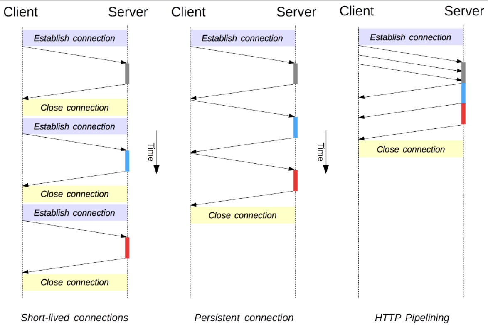
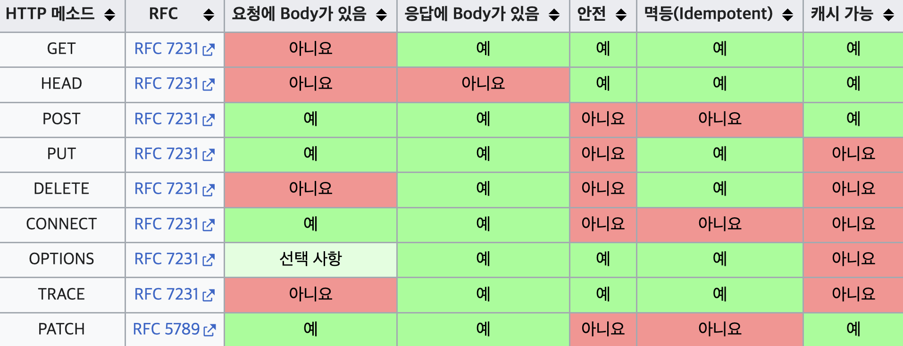

## HTTP (HyperText Transfer Protocol)
인터넷에서 데이터를 주고 받을 수 있는 프로토콜이다.

## HTTP 특징
### 클라이언트 서버 구조
- Request Response 구조
- 클라이언트가 서버에게 HTTP 요청을 보내면 서버는 요청한 데이터를 HTTP 응답을 통해 보내주는 클라이언트 서버 구조로 이루어져 있다.


- 클라이언트: 서버에 요청을 보내고, 응답 대기
- 서버: 요청에 대한 결과를 만들어서 응답 전송

### Stateless (무상태성)
- 서버가 클라이언트의 상태를 보존하지 않는다.
- 장점: 확장성이 높음 (서버가 바뀌어도 영향이 없음)
- 단점: 클라이언트가 추가 데이터 전송

로그인같이 상태를 유지해야할 경우에는 쿠키와 세션등을 사용해서 상태를 유지한다. 단, 상태 유지는 최소한만 사용하는게 좋음

### Connetionless (비 연결성)
HTTP는 기본이 연결을 유지하지 않는 모델이다. 실제로 요청을 주고 받을 때만 연결을 유지하고 응답을 주고나면 서버와의 연결을 끊는다.

장점: 서버 자원을 최소화하기 때문에 효율적으로 사용할 수 있음 (부하를 줄일 수 있음)

단점: 새로 연결을 할 때마다 자원을 다시 다운로드 받아야함. 지금은 지속 연결로 최적화함. 이러한 단점들을 HTTP/2, HTTP/3에서 최적화함.

### Keep-alive
keep alive는 클라이언트측에 연결을 유지하라는 신호를 보내기 위해서 사용한다.그러면 클라이언트는 최대 timeout에 지정된 시간동안 연결을 유지한다. 이 시간동안 클라이언트는 이미 맺어진 연결로 요청을 계속 보낼 수 있다.

- HTTP 1.1 부터는 keep-alive 기능을 지원한다. 

#### keep alive 지원하지 않을 경우
```
- 웹 서버에 연결한다.
- HTML 문서를 다운로드 한다.
- 웹 서버 연결을 끊는다.
- HTML 문서의 image, css, javascript 링크들을 읽어서 다운로드해야할 경로를 저장한다.
- 웹 서버에 연결한다.
- 첫번째 이미지를 다운로드
연결을 끊는다.
- 웹 서버에 연결한다.
- 두번째 이미지를 다운로드 연결을 끊는다.
```
#### keep alive 지원
```
- 웹 서버에 연결한다.
- HTML 문서를 다운로드 한다.
- Image, css, javascript 들을 다운로드 한다.
- 모든 문서를 다운로드 받았다면 연결을 끊는다.
```

### HTTP 파이프라이닝


영속적인 커넥션 모델은 연속적인 요청 사이에 커넥션을 유지하여 새 커넥션을 여는데 필요한 시간을 줄이지만. 파이프라이닝은 한 단계 더 나아가, 응답조차도 기다리지 않고 연속적인 요청을 보내서 네트워크 지연을 더욱 줄인다.

## HTTP METHOD
HTTP 메서드는 Client가 Server에게 요청할 때 기대하는 행동을 말한다. 예시를 들어 설명해보겠다.

API URI 설계를 해본다고 하자. 필요한 데이터 목록들은 아래와 같다.

유저 정보 조회, 유저 등록, 유저 수정, 유저 삭제

필요한 데이터와 행동들에 따라 URI을 설계해보겠다.

- 유저 조회: `/users-read`
- 유저 등록: `/users-create`
- 유저 수정: `/users-update`
- 유저 삭제: `/users-delete`

필요한 데이터와 행동들에 따라 URI를 설계했지만 과연 이게 옳은 API 설계일까? 아니다. 잘 생각해보면 DB에 저장되는 데이터 = 리소스는 유저의 정보 하나이다. DB에서 관리할 리소스에 따라 이 데이터를 어떻게 관리할지에 대한 행동을 나타내는게 메서드이다. API를 설계할 때 가장 중요한 것은 리소스와 행위를 분리해야한다.

말한 개념대로 URI를 설계해보면 `/users/{id}`로 통일되고 어떤 행동을 할 건지는 메서드를 Header에 전달하면 된다.

자, 그럼 메서드 종류에 대해서 알아보자!

| 메서드 | 설명 |
|-------------|------|
| GET | 서버로부터 리소스를 조회. 데이터는 주로 쿼리 매개변수를 통해 전송 |
| POST | 요청 데이터 처리, 주로 등록|
| PUT | 기존 리소스를 대체하거나 없는 경우 새로 생성 |
| PATCH | 리소스 부분 수정 |
| DELETE | 리소스 삭제 |

### POST와 PUT 차이점
클라이언트가 리소스 위치를 알고 URI 지정한다.
```
POST/users HTTP/1.1
Content-Type: application/json
{
    "name": "daon",
    "age": 24
}
```

```
PUT/users/100 HTTP/1.1
Content-Type: application/json
{
    "name": "daon",
    "age": 24
}
```
POST는 Client가 신규 정보를 body에 담아주면 응답으로 id값을 생성해서 보내주지만, PUT은 Client가 변경해야할 위치, 즉 어떤 id를 가진 유저의 정보를 수정할 것인지를 알고 요청에 담아서 보낸다.

### PATCH와 PUT 차이점
- PUT은 데이터를 대체하지만, PATCH는 부분 변경한다.

## HTTP 상태 코드

| 상태 코드 | 설명 |
|-------------|------|
| 1xx | (Informational) 조건부 응답 |
| 2xx | (Successful) 성공|
| 3xx | (Redirection) 리다이렉션 완료 |
| 4xx | (Client Error) 요청 오류 |
| 5xx | (Server Error) 서버 오류|


## 메시지 포맷



## 학습 체크

학습한 내용을 바탕으로 질문에 스스로 답해보자.

### 📌 HTTP 프로토콜

- HTTP 프로토콜이 무엇인가요?
- HTTP의 요청/응답 모델에 대해 설명해주세요.
- HTTP 메서드가 뭔가요? 알고 있는 메서드 몇가지 알려주세요.
- HTTP 메서드중 GET과 POST의 차이점은 뭔가요?
- HTTP 메서드중 PUT과 PATCH의 차이점은 뭘까요?
- HTTP 상태 코드가 뭔가요? 알고 있는 상태 코드 몇가지 알려주세요.
- HTTP 헤더가 뭘까요? 알고 있는 헤더 몇 가지 설명해주세요.
- HTTP의 무상태성(Stateless)에 대해서 설명해주세요.
- HTTP Keep-Alive에 대해서 설명해주세요.
- HTTP 파이프라이닝에 대해서 설명해주세요.
- HTTP/1.1, HTTP/2, HTTP/3 각각의 특징에 대해 설명해주세요.

## Reference

- [모든 개발자를 위한 HTTP 웹 기본 지식 - 인프런 | 강의](https://inf.run/8ZEU8)
- [HTTP 개요 - HTTP | MDN](https://developer.mozilla.org/ko/docs/Web/HTTP/Overview)
- [프런트엔드 개발자가 알아야하는 HTTP 프로토콜 Part 1 • 캡틴판교 블로그](https://joshua1988.github.io/web-development/http-part1/)
- [http의 개념(keep-alive, connectless, 응답 헤더, 요청 헤더) – JOOS](https://joosjuliet.github.io/http/)