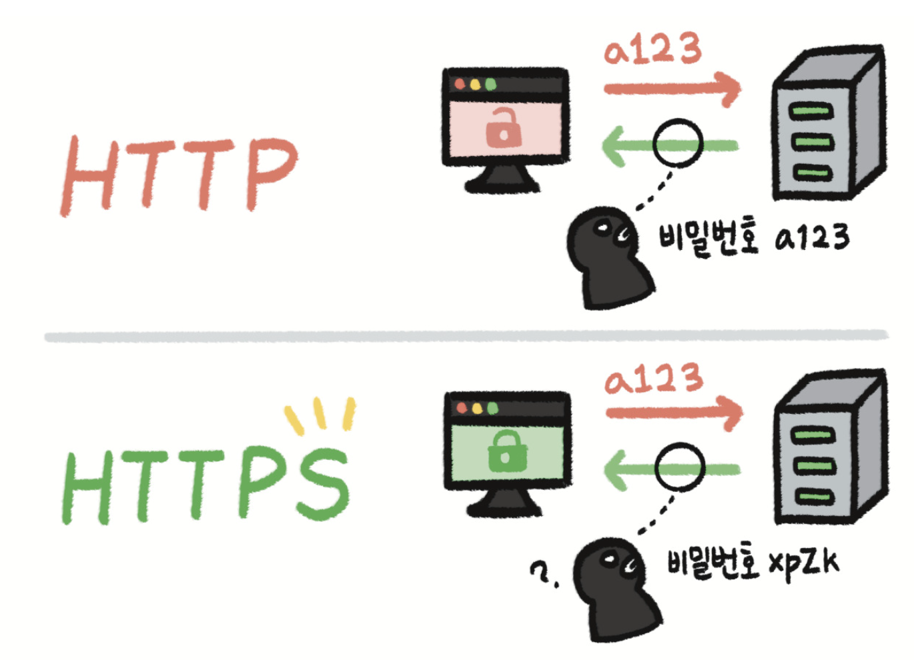
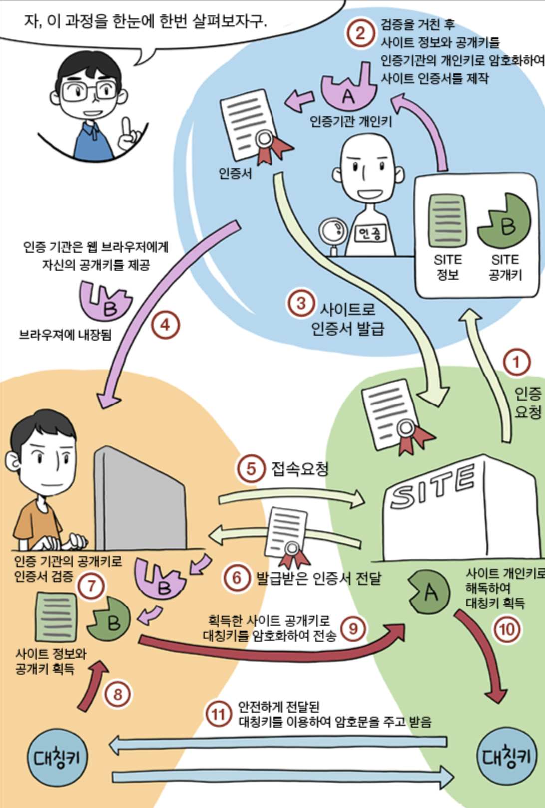
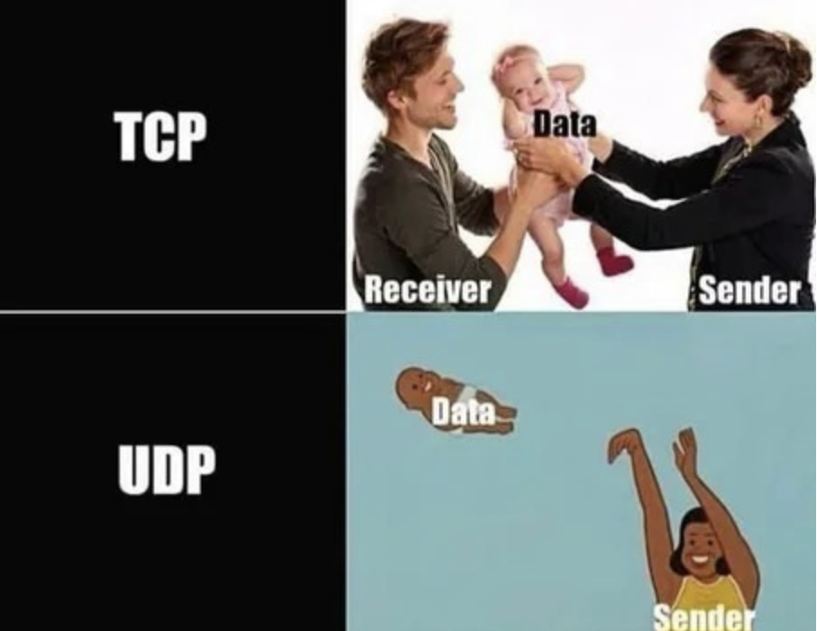

## HTTPS

- Hypertext Transfer Protocol Secure
- HTTP에서 보안(secure)이 강화된 프로토콜이며, 메시지를 암호화한다는 점이 가장 큰 특징이다.
- HTTP는 암호화가 되어있지 않은 방법으로 서버에 데이터를 전송하기 때문에 서버와 클라이언트가 주고받는 메시지를 알아내기 쉽다.
- 로그인 정보, 계좌번호 등 중요한 데이터를 서버로 전송할 경우 HTTPS 프로토콜을 사용하여 통신하는 것이 중요하다.
- HTTPS는 SSL(보안 소켓 계층)을 사용.

## HTTPS를 사용해야하는 이유
- 보안 이슈
- 검색엔진 최적화(SEO): 구글은 HTTPS로 설정된 사이트에 추가적인 가산점을 준다.
- 가속화된 모바일 페이지: AMP는 모바일 기기에서 빠르게 콘텐츠를 로딩하기 위한 방법으로 Google이 개발함

## SSL
- Secure Sockets Layer
- 서버와 브라우저 사이에 암호화된 연결을 만들 수 있게 도와주고, 서버와 브라우저가 민감한 정보를 주고받을 때 해당 정보가 도난당하는 것을 막아준다.
- 공개키/개인키, 대칭키 기반으로 사용함.
### HTTP 전체를 암호화하는 걸까?
놉! HTTP body만 암호화한다.

## 대칭키
- 동일한 키로 암호화와 복호화를 할 수 있는 기법을 말한다. 
- 키(key): 암호화를 할 때 사용하는 비밀번호
- 이 키에 따라서 암호화된 결과가 달라지기 때문에 키를 모른다면 암호를 푸는 행위인 복호화도 할 수 없다.
- 예시: 123을 사용하여 암호화하였다면 복호화도 123을 입력해야 가능.

### 단점
- 클라와 서버는 대화를 하기 위해서 반드시 대칭 키를 알고 있어야 한다. 그렇기 때문에 통신을 하기 앞서 키를 전달해야하는 과정이 필요하다.
- 그런데 만약 중간에 대칭키가 유출된다면 키를 획득한 공격자는 암호화된 데이터를 복호화하여 볼 수 있기 때문에 HTTPS를 사용할 필요성이 사라진다.
- 이런 단점을 보완하기 위해 나온 방식이 공개키 기법이다.

## 공개키
- 서로 다른 키 2개(공개키, 개인키)로 암호화, 복호화를 한다.
- 비밀키는 자신만이 소지하고 공개키는 타인에게 제공한다.
- 공개키로 암호화하면 비밀키로 복호화 한다. 비밀키로 암호화하면 공개키로 복호화한다.
- 예시: 클라이언트가 서버의 공개키를 가지고 1234(정보)를 암호화하여 서버에게 !@#$라는 text를 전달한다. 서버는 클라이언트가 보낸 !@#$라는 단어를 비밀키로 복호화하여서 1234라는 것을 확인한다.
- 공개키는 공개되어 있으며 보통 디지털 인증서안에 포함되어 있다. 그렇기 때문에 공개키가 존재한다는건 서버의 신원이 안전하다고 볼 수 있다. 이것을 우리는 전자서명이라고 부른다.

### 단점
- 공개키 암호화 방식의 알고리즘은 계산이 느리다는 단점이 있다.

## SSL 통신 과정

## DNS
- Domain Name System
- 도메인 이름을 IP 주소로 변환해주는 시스템 (인터넷 전화번호부)
- UDP로 동작한다.

### DNS 레코드
- DNS 레코드는 도메인 이름과 관련된 정보를 저장하는 데이터 항목. 
- 각각의 레코드 유형은 특정한 유형의 정보를 나타내며, 다음과 같은 역할을 한다.
  - A Record (Address Record): 도메인 이름을 IPv4 주소로 매핑
  - AAAA Record (IPv6 Address Record): 도메인 이름을 IPv6 주소로 매핑
  - CNAME Record (Canonical Name): 도메인을 다른 도메인에 별칭으로 연결한다.
  - MX Record (Mail Exchange): 메일 서버 정보를 지정
  이러한 레코드들은 DNS 시스템을 통해 도메인 이름을 실제로 사용 가능한 IP 주소로 변환하거나, 다른 유용한 정보를 제공하는 데 사용된다.

## UDP
- 비연결형, 신뢰성이 없는 전송 프로토콜 (TCP/IP에서 전송계층에 프로토콜)

- TCP: 신뢰성 / UDP: 신속성
- UDP는 트랜스포트 계층 프로토콜이 할 수 있는 최소 기능으로 동작
### DNS가 UDP를 사용하는 이유
- TCP는 데이터 전송 전 3-way-handshake를 사용하는 반면에 udp는 형식적인 예비동작이 없다. 따라서 연결 설정에 드는 비용이 없다. (속도 up!)
- 도메인네임을 ip로 변경함으로 항상 많은 클라이언트를 수용하는 dns 서버에게는 연결상태를 유지 하지 않아 정보 기록을 최소화 하는 udp가 알맞다.

## 참고
- [HTTPS가 뭐고 왜 쓰나요? (Feat. 대칭키 vs. 비대칭키)](https://www.youtube.com/watch?v=H6lpFRpyl14)
- https://m.blog.naver.com/PostView.naver?isHttpsRedirect=true&blogId=ssl_study&logNo=30151160122
- https://www.youtube.com/watch?v=kBlQiwXSx8A
- https://sarc.io/index.php/was/2087-https
- https://www.youtube.com/watch?v=wPdH7lJ8jf0
- https://kingofbackend.tistory.com/198#article-1--%EB%8F%84%EB%A9%94%EC%9D%B8-%EC%9D%B4%EB%A6%84%EA%B3%BC-ip%EC%A3%BC%EC%86%8C%EB%A5%BC-%EC%84%9C%EB%A1%9C-%EB%B3%80%ED%99%98%ED%95%98%EB%8A%94-%EC%97%AD%ED%95%A0%EC%9D%84-%ED%95%98%EB%8A%94-dns%EB%8A%94-%EC%99%9C-udp%EC%97%90-%EC%86%8D%ED%95%B4-%EC%9E%88%EC%9D%84%EA%B9%8C?
- https://www.stevenjlee.net/2020/11/01/%EC%9D%B4%ED%95%B4%ED%95%98%EA%B8%B0-http-vs-https-%EA%B7%B8%EB%A6%AC%EA%B3%A0-ssl-secure-socket-layer/

# 질문지
## HTTPS
### HTTPS에 대해서 설명해주세요.
HTTPS는 HyperText Transfer Protocol Secure의 약자로, 웹 브라우저와 웹 서버 간의 데이터 통신을 암호화하는 프로토콜입니다. 

### SSL/TLS이 뭔가요?

SSL과 TLS는 데이터 통신을 암호화하기 위한 프로토콜입니다. HTTPS는 주로 SSL 또는 TLS 프로토콜을 사용하여 암호화된 연결을 설정합니다.

## DNS
### DNS가 뭔가요?
도메인 이름을 IP 주소로 변환해주는 시스템입니다.

###  DNS 서버에게 IP 주소를 요청할 때, 왜 UDP를 사용하나요?
DNS는 일반적으로 작은 양의 데이터를 빠르게 전송해야 하므로 UDP를 사용합니다. TCP보다 경량이고 빠르게 동작하는 특성 때문에 DNS 쿼리는 UDP를 선호합니다.

### DNS 레코드가 무엇인가요?
DNS 레코드는 도메인 이름과 관련된 다양한 정보를 저장하는데 사용되는 데이터 항목입니다. 위에서 언급한 A, AAAA, CNAME, MX 등이 DNS 레코드의 예시입니다.

## UDP
### UDP에 대해 설명해주세요.
UDP(User Datagram Protocol)는 전송 계층 프로토콜로, 데이터를 신속하게 전송하는 데 중점을 둔 비연결형 프로토콜입니다.

### UDP의 장단점을 설명해 주세요.
장점: 높은 성능과 낮은 지연 시간을 제공합니다.
단점: 신뢰성이 낮고, 패킷 손실이 발생할 수 있습니다.

### UDP 체크섬에 대해 설명해주세요.
UDP 체크섬은 데이터의 무결성을 확인하기 위한 값으로, 송신자가 전송한 데이터의 오류 여부를 수신자가 확인하는 데 사용됩니다.

## 신뢰적 데이터 전송의 원리

### 전송후 대기 프로토콜이 뭘까요?
전송 후 대기 프로토콜은 송신자가 일정 시간 동안 수신자의 확인 응답을 기다리는 방식입니다. 이 시간 동안 응답이 없으면 송신자는 패킷을 다시 전송합니다.

### 파이프라인 프로토콜이 뭘까요?
파이프라인 프로토콜은 여러 개의 패킷을 한 번에 전송하고, 수신자는 이를 받은 후에 일괄적으로 응답하는 방식입니다. 이를 통해 효율적인 데이터 전송이 가능합니다.