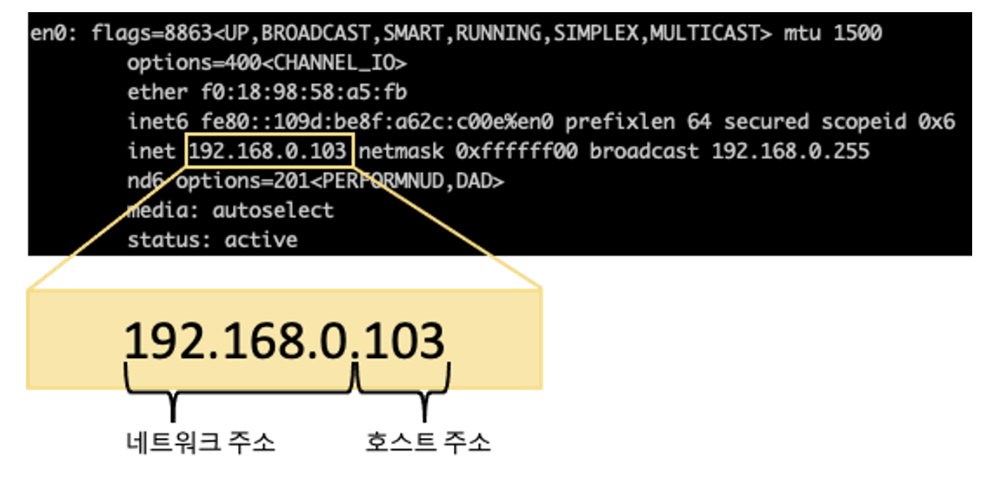
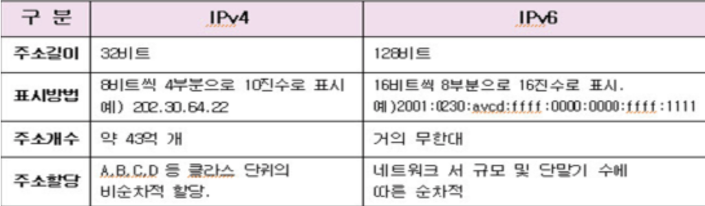
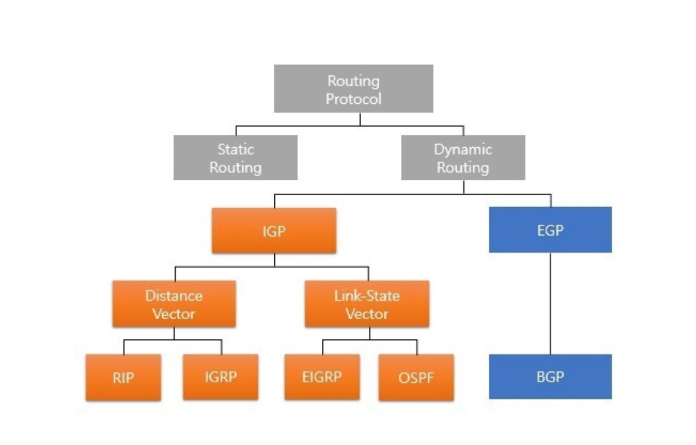

## IP 주소
IP주소란 네트워크 상에서 컴퓨터 장치를 식별하기 위한 고유한 주소이다.
현재 네트워크는 IPv4를 사용하고 있음

dot(.)으로 구분한다. 이를 옥텟이라함

## IPv4, IPv6 차이점

## Public IP와 Private IP 차이
- Public IP는 인터넷에서 직접 접근 가능한 공개적인 주소
- Private IP는 사설 네트워크에서 사용되는 주소로 외부에서 직접 접근할 수 없다. 

가장 큰 차이점은 인터넷에 직접 연결될 수 있는지 여부!
public은 인터넷상에서 공개되어있기 때문에 접근가능하지만 Private IP는 NAT(Network Address Translation)를 사용하여 Private IP 주소를 Public IP 주소로 변환하여 외부와 통신한다.

## IP 할당
IP가 할당되는 방법에는 정적 할당과 동적 할당이 있다.

### 정적 할당
- 특정 장치에 고정된 IP 주소가 수동으로 할당된다. 한 번 설정하면 변경되지 않으며, 주로 서버나 중요한 네트워크 기기에 사용된다.
- 장점: 설정이 변하지 않기 때문에 관리가 용이하며, 특정 서비스나 장치를 식별하기 쉬움.
- 단점: 대규모 네트워크에서 모든 장치에 대해 수동으로 관리해야 하므로 번거로움

### 동적 할당
- IP 주소 동적으로 할당, 장치가 네트워크에 연결될 때 DHCP(Dynamic Host Configuration Protocol) 서버로부터 동적으로 IP 주소를 할당받는다.
- 장점: 자동으로 관리되므로 네트워크 관리가 용이하며, 주소 충돌을 방지할 수 있다.
- 단점: IP 주소가 변경될 수 있어서 특정 서비스를 식별하기 어려울 수 있다.

정적 할당은 주로 서버, 네트워크 장치 등에 사용되며, 동적 할당은 클라이언트 장치들이 주로 사용한다.

## 서브넷
IP 주소를 하위 네트워크로 분할하는 기술. 주로 큰 네트워크를 작은 네트워크로 나누어 효율적인 관리와 리소스 할당을 가능하게 한다. 이때, 서브넷을 구성하는 데 사용되는 것이 서브넷 마스크!

## 서브넷 마스크
IP Address에서 첫비트부터 어디까지가 네트워크 부분인가 알려주는 역할이다. 쉽게 생각하면 IP 주소에 마스크를 씌워서 어디까지가 네트워크 부분인가를 표시하는 것이다. IP Address처럼 32비트로 구성되며, 네트워크 부분을 표시하는 비트는 1, 호스트 부분은 을 표시하는 비트는 0이다. 또한,연속성이 존재해서 네트워크 부분 중간에 0이 들어갈 수 없다.

예를 들어, IP 주소 192.168.1.1에 서브넷 마스크가 255.255.255.0라면 255로 표시된 부분인 192.168.1.까지는 네트워크 부분이고 0으로 표시된 부분인 .1은 호스트 부분이다. 다시 말해, 255는 이진법으로 표시하면 1111111이기 때문에 네트워크 부분인 것이다.

## 라우팅
라우터가 패킷을 어디로 전송할지 결정하는 것을 라우팅이라고 한다. 데이터 패킷이 도착하면 라우터는 먼저 라우팅 테이블에서 그 주소를 찾고 라우터는 패킷을 네트워크의 다음지점으로 전달하거나 이동한다.

ex) 목적지까지 가는데 적합한 버스 노선을 찾기 위해 버스 시간표를 참조하는 승객

### 라우팅 프로토콜
라우터가 패킷을 식별하고 네트워크 경로를 따라 전달하는 방법을 지정하는 규칙. 

- 정적라우팅(Static routing): 관리자에 의해 Routing Table이 유지/관리 되는 기법
라우팅 테이블을 교환하지 않고 라우팅이 가능하기 때문에 네트워크 대역폭을 절약할 수 있다. 또한 외부에 자신의 경로를 알리지 않기 때문에 보안에도 강하다. 하지만 경로에 문제가 생길 경우 대처하기 어렵다는 단점이 있다.

- 동적라우팅(Dynamic routing): 라우팅 프로토콜에 의해 자동으로 라우팅 테이블을 구성하는 기법
자동으로 경로가 결정되는 프로토콜이다. 라우터가 판단하여 가장 효율적인 방법으로 패킷을 전송시키는 방법이다.

## 참고
[IP주소란 무엇인가?](https://catsbi.oopy.io/15f97a5f-acc8-410e-afab-0b26adff89c5)
[[Network] IP주소란?](https://limkydev.tistory.com/167?category=954021)
[개발자를 꿈꾸는 프로그래머 :: IPV4 와 IPV6 의 차이점과 문제점](https://jwprogramming.tistory.com/28)
[Subnet Mask란?](https://youngkyonyou.github.io/network/2022/02/05/Network-SubnetMask-02.html)
[라우팅 프로토콜 RIP, BGP, OSFP](https://velog.io/@yh_lee/%EB%9D%BC%EC%9A%B0%ED%8C%85-%ED%94%84%EB%A1%9C%ED%86%A0%EC%BD%9C-RIP-BGP-OSFP)

### IP주소에 대해서 설명해주세요.

IP 주소:
IP 주소는 컴퓨터 네트워크에서 장치를 식별하기 위한 고유한 주소입니다. IP 주소는 데이터 패킷이 네트워크에서 어디로 전송되어야 하는지를 나타내며, 인터넷에서 통신하는 모든 장치에 할당됩니다. IP 주소는 IPv4와 IPv6 두 가지 버전이 있습니다.
    
### IPV4와 IPV6는 어떤 차이점이 있을까요?
주소 길이: IPv4는 32비트 주소체계를 사용하며, 주소의 수가 제한되어 있어 고갈 문제가 발생했습니다. IPv6는 128비트 주소체계를 사용하여 주소 공간을 확장했습니다.

주소 표기법: IPv4 주소는 네 개의 8비트 숫자로 나뉘어 표기되며 각 숫자는 점으로 구분됩니다. 예를 들면, 192.168.0.1과 같습니다. IPv6는 16진수로 표기되며 콜론으로 구분됩니다.

주소 공간: IPv6는 거의 무한대의 주소를 제공하여 주소 부족 문제를 해결했습니다.
    
### 서브넷과 서브넷 마스크에 대해 설명해주세요.
서브넷은 큰 네트워크를 더 작은 네트워크로 분할하는 것을 의미하며, 서브넷 마스크는 어떤 부분이 네트워크 주소이고 어떤 부분이 호스트 주소인지를 나타냅니다. 서브넷을 사용하면 네트워크를 관리하기 용이하며, 효율적인 IP 주소 할당이 가능합니다.
    
### 라우팅이 뭘까요?
라우팅은 패킷이 출발지에서 목적지로 전송되기 위한 경로를 결정하는 과정입니다. 라우터는 라우팅 테이블을 사용하여 어떤 경로를 통해 패킷을 전송할지 결정하고, 최적의 경로를 찾아 목적지에 도달시킵니다.
    
### Public IP와 Private IP 차이는 뭘까요?
Public IP는 인터넷에서 직접 접근 가능한 공개적인 주소이며, Private IP는 사설 네트워크에서 사용되는 주소로 외부에서 직접 접근할 수 없습니다. 일반적으로 NAT(Network Address Translation)를 사용하여 Private IP 주소를 Public IP 주소로 변환하여 외부와 통신합니다.
    
### 라우팅 프로토콜에 대해서 설명해주세요.
라우팅 프로토콜은 네트워크에서 라우터 간에 경로 정보를 교환하는 규약입니다. 몇 가지 라우팅 프로토콜에는 RIP, OSPF, BGP 등이 있으며, 각각 다른 상황에 적합한 경로 선택 알고리즘을 사용합니다.
    
### IP는 어떻게 할당될까요?
IP 주소는 DHCP(Dynamic Host Configuration Protocol)를 통해 자동으로 할당되기도 하고, 수동으로 관리자에 의해 할당될 수도 있습니다. DHCP는 네트워크에 연결된 기기에 자동으로 IP 주소, 서브넷 마스크 등을 할당하여 네트워크 구성을 간편하게 합니다.
    
    
### NAT가 뭘까요?
NAT는 사설 네트워크에서 외부와 통신하기 위해 Private IP 주소를 Public IP 주소로 변환하는 기술입니다. 이를 통해 여러 기기가 하나의 공인 IP 주소를 공유할 수 있고, 보안 측면에서도 내부 네트워크를 감추어 외부에서 직접 접근하지 못하도록 합니다.
    
    
### ICMP가 뭘까요?
ICMP(Internet Control Message Protocol)는 네트워크에서 메시지를 전송하고 받는 데 사용되는 프로토콜입니다. 주로 네트워크 상태 및 오류 메시지를 전송하는데 활용됩니다.