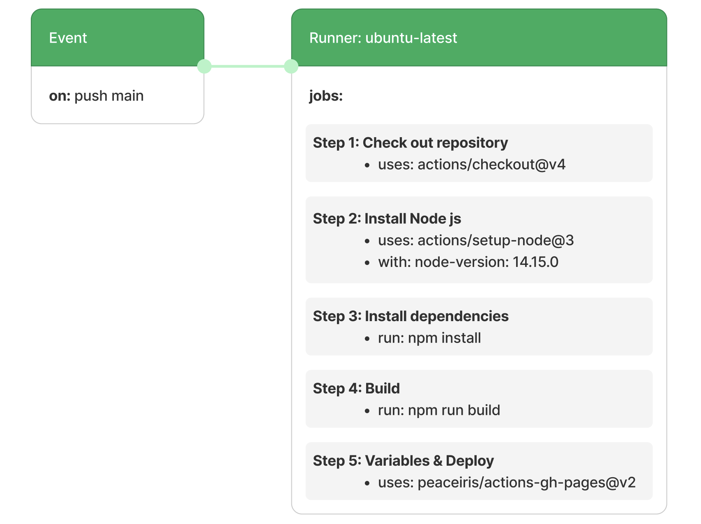

Github Actions는 워크플로를 자동화하는 도구로, YAML 파일을 사용하여 빌드, 테스트, 배포 등 다양한 작업을 자동화할 수 있다.

블로그를 gh-pages로 배포했지만 글을 작성할 때마다 npm deploy를 매번 입력해주는게 번거로웠기 때문에 Github Actions를 통해 배포 과정을 자동화하기로 했다.

## 워크플로 등록
`github/workflows` 폴더에 `deploy.yml` 파일을 추가하여 워크 플로우를 등록하자.

```yml
name: build gatsby # 워크플로 이름

on:
  push:
    branches:
      - main
```

Github Actions는 저장소에 이벤트가 발생할 때 워크플로를 실행할 수 있게 해준다. main 브랜치에 푸시하면 워크플로를 실행하도록 설정했다.

### 작업 정의
워크플로 내에서 실행할 작업을 정의해보자. 이벤트가 트리거되면 jobs에 정의한 작업들이 순차적으로 실행된다.

```yml
jobs:
  build_gatsby:
    name: build
    runs-on: ubuntu-latest
    steps:
      - uses: actions/checkout@v1
      - uses: actions/setup-node@v2
        with:
          node-version: '14.15.0'

      - name: Install dependencies
        run: npm install

      - name: Build
        run: npm run build

      - uses: peaceiris/actions-gh-pages@v2
        env: # 환경 변수 설정
          GITHUB_TOKEN: ${{ secrets.GH_TOKEN }}
          PUBLISH_BRANCH: deployment
          PUBLISH_DIR: ./public
```

1. runs-on은 Github에서 호스팅되는 가상 환경을 의미한다. 이 레포는 ubuntu-latest 환경에서 실행된다.

2. 워크플로에서 레포에 있는 코드를 사용할 때 체크아웃을 작업을 해줘야하기 때문에 `actions/checkout` 액션을 사용해서 코드를 가져온다.

3. `actions/setup-node`를 사용하여 Node.js 버전을 설치한다. 로컬 프로젝트 노드 버전과 동일하게 기재해주자.

4. 종속성을 설치하고, Gatsby 프로젝트를 빌드하고, 배포를 위해 `peaceiris/actions-gh-pages@v2` 액션을 사용한다.

이러한 과정들을 시각화를 해보았다.



정리하자면, 이벤트가 트리거되는 순간 build gatsby라는 이름의 워크플로가 실행이 되며, ubuntu-latest 환경에서 step 1 -> step 2 ... 단계별로 실행하며 gh-pages로 배포가 된 후 deployment 브랜치에 푸쉬된다.


## 환경 변수 등록

`Settings > Security > Secrets and variables > actions` 에서 환경 변수를 등록 해준다.

key는 yml에서 지정한 환경 변수 이름과 똑같이 GH_TOKEN으로 하고 value에 토큰 값을 입력해주고 저장하면 된다.

<p align="center">
  
</p>

## References
- [Understanding GitHub Actions](https://docs.github.com/en/actions/learn-github-actions/understanding-github-actions)